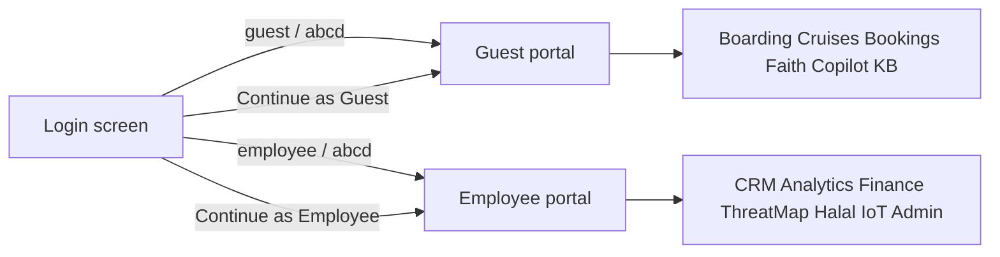
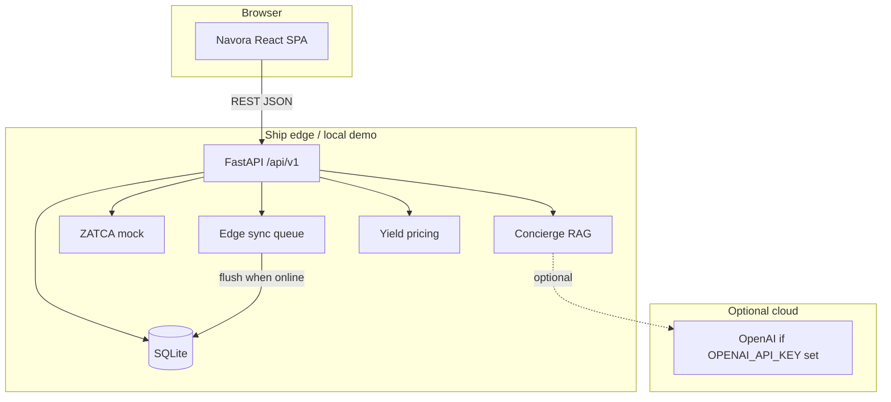
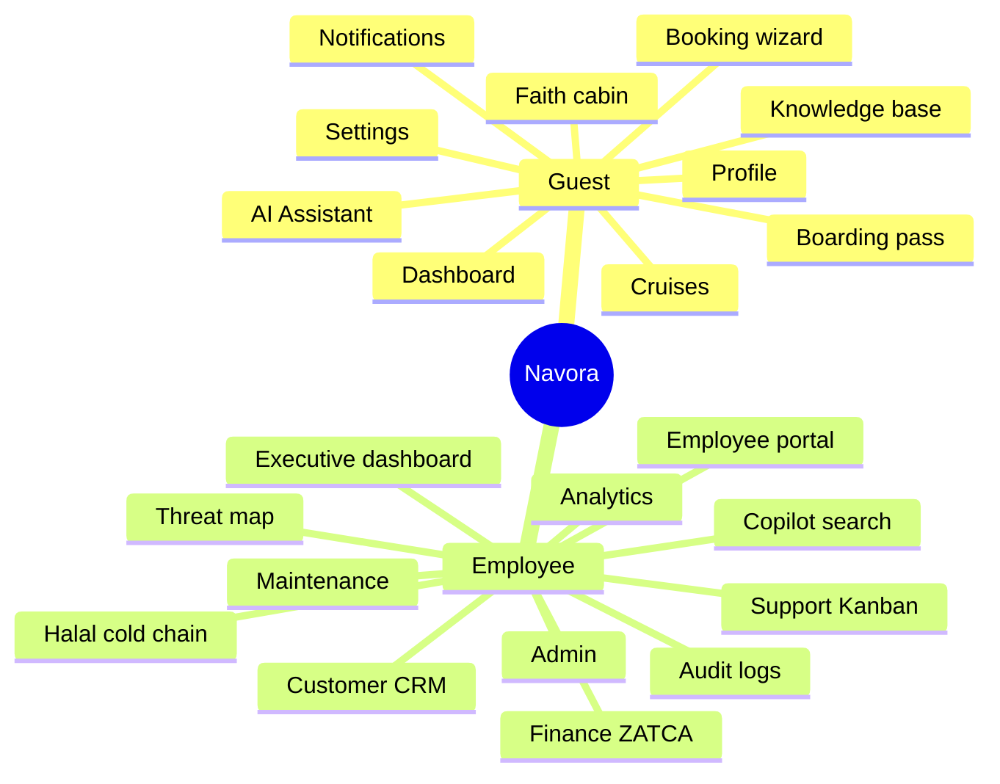
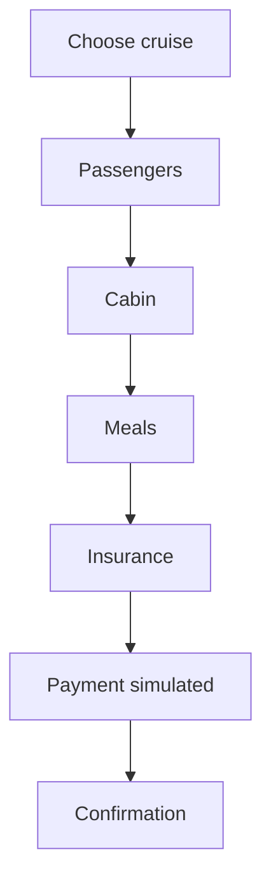
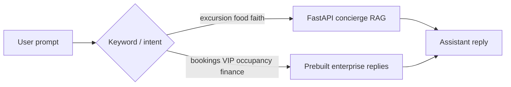
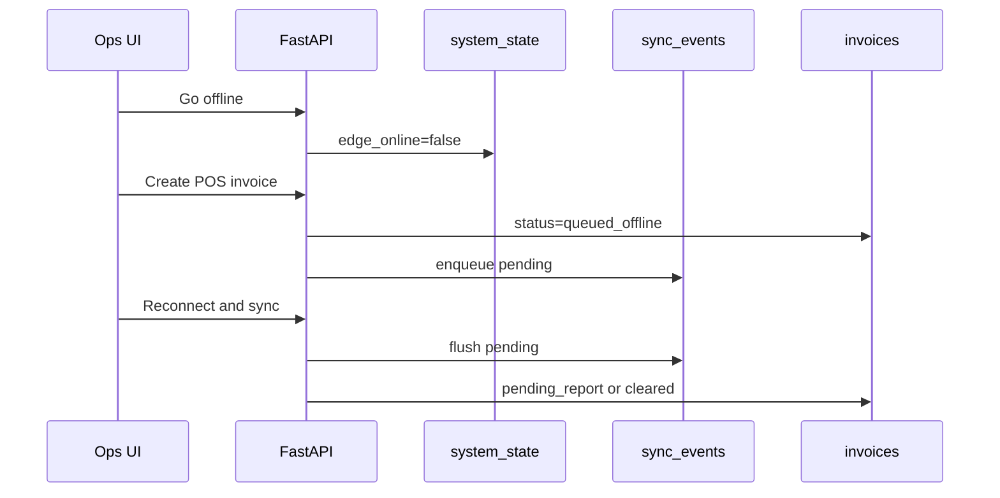
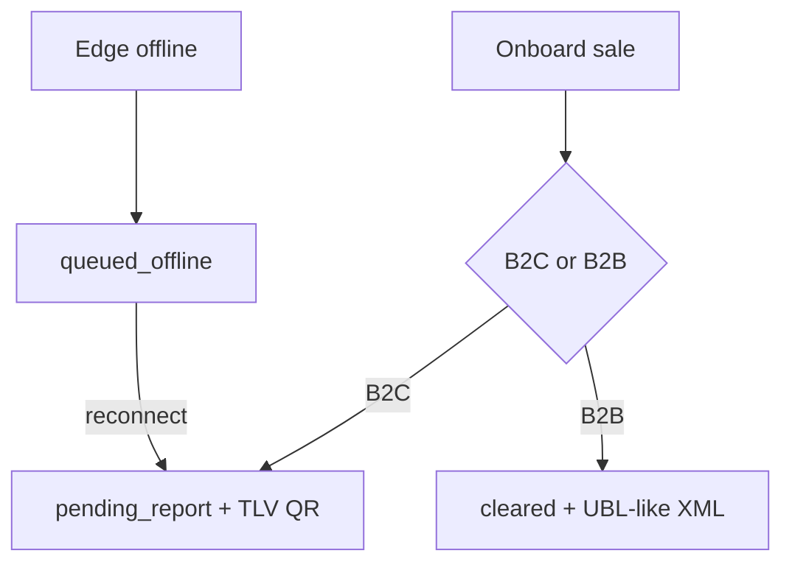
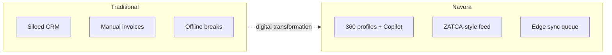
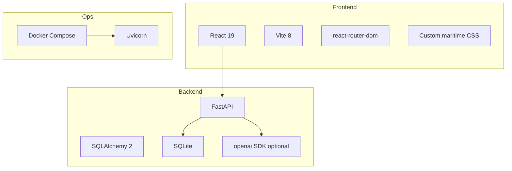
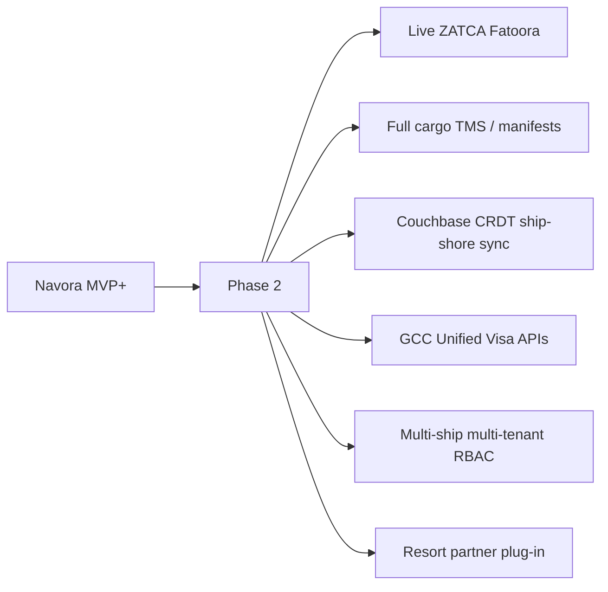

# Navora

**AI Enterprise Operating System for Cruise and Cargo Fleets**

Pitchable MVP+ prototype for Middle Eastern maritime operations on the Arabian Sea to Red Sea corridor. Navora covers **cruise liners** and **cargo ships** with role-based portals, AI Copilot, CRM/ERP dashboards, ZATCA-style finance, Halal cold-chain, and edge-sync storytelling - backed by polished React UI, mock enterprise data, and an optional FastAPI backend.

| | |
|---|---|
| **Product** | Navora |
| **Domain** | Cruise tourism + cargo maritime ops |
| **Region demo** | Muscat · Jeddah · Aqaba |
| **Frontend** | React (Vite) |
| **Backend** | FastAPI + SQLite (optional for live demos) |
| **Default ports** | Frontend `5173` · API `8888` |

**Deep docs:** [docs/DESIGN.md](docs/DESIGN.md) · [docs/TECHNICAL_ARCHITECTURE.md](docs/TECHNICAL_ARCHITECTURE.md) · [docs/CRUISEOS_MVP_PLUS.md](docs/CRUISEOS_MVP_PLUS.md)

---

## Table of contents

1. [Why Navora](#why-navora)
2. [Demo login](#demo-login)
3. [System architecture](#system-architecture)
4. [Role-based portals](#role-based-portals)
5. [Feature map](#feature-map)
6. [Key workflows (diagrams)](#key-workflows-diagrams)
7. [Technology stack](#technology-stack)
8. [Repository layout](#repository-layout)
9. [Quick start](#quick-start)
10. [Environment variables](#environment-variables)
11. [API highlights](#api-highlights)
12. [Pitch demo script](#pitch-demo-script)
13. [What is mock vs live](#what-is-mock-vs-live)
14. [Roadmap (Phase 2+)](#roadmap-phase-2)

---

## Why Navora

Traditional maritime stacks are fragmented: reservations, PMS, POS, loyalty, inventory, cargo manifests, and finance live in separate tools. Ships also face intermittent satellite connectivity.

Navora demos a **system of intelligence**:

| Need | How Navora shows it |
|------|---------------------|
| Unified guest / shipper view | CRM profiles, timelines, CLV, churn risk |
| AI operations | Navora Copilot + page AI actions |
| Cruise + cargo together | Passenger portal + cargo ETA / fleet KPIs |
| Regional compliance | Mock ZATCA Phase 2 B2C/B2B feed |
| Halal logistics | Cold-chain chart + compliance badge |
| Faith-aware cruise UX | Qibla compass + prayer times |
| At-sea resilience | Edge online/offline sync queue (API) |
| Geopolitical risk | Threat map + safe-route overlay |

---

## Demo login

| Portal | Username | Password | Lands on |
|--------|----------|----------|----------|
| Guest (passenger) | `guest` | `abcd` | Passenger dashboard |
| Employee (ops / ERP) | `employee` | `abcd` | Executive dashboard |

Or use **Continue as Guest** / **Continue as Employee** on the login screen.



---

## System architecture

High-level view of the monorepo runtime:



**Pitch story:** static ship assets are edge-cached in the app; dynamic actions hit the local edge API and sync shoreside when satellite bandwidth allows. Offline queues are CRDT-ready for Phase 2.

---

## Role-based portals



### Guest portal

- Smart embarkation / digital boarding pass (QR, arrival window, congestion)
- Cruise cards + multi-step booking wizard
- Navora Copilot / AI assistant
- Faith cabin: Qibla + prayer times (mock Red Sea GPS)
- Knowledge base search
- Notifications and profile

### Employee portal

- Executive KPIs + AI insight cards (cruise occupancy + cargo ETA)
- Customer CRM with CLV, churn, timeline, AI summary
- Analytics + forecast cards
- Support Kanban with AI suggested replies
- ZATCA live feed simulation
- Geopolitical threat map + safe route
- Halal cold-chain chart + Shariah compliance badge
- Predictive maintenance dispatch
- Employee tasks / leaderboard
- Admin panel, audit logs, activity feed
- Global smart search + floating Copilot + AI action chips

---

## Feature map

| Module | Demo ready | Deep backend |
|--------|------------|--------------|
| Login RBAC (guest/employee) | Yes | No (hardcoded) |
| Executive / passenger dashboards | Yes | No |
| Customer CRM + timeline | Yes | Minimal |
| Cruise catalog + booking wizard | Yes | Minimal |
| Navora Copilot | Yes | Optional LLM |
| Support Kanban | Yes | No |
| ZATCA monitor / invoices | Yes | Optional API |
| Threat map | Yes | No |
| Halal cold-chain IoT chart | Yes | Optional sensors API |
| Maintenance dispatch | Yes | Optional work orders |
| Admin / audit / notifications | Yes | No |
| Faith Qibla cabin | Yes | Client calc |
| Edge offline sync | Yes | FastAPI sync queue |
| Yield pricing on experiences | Yes | FastAPI offers |

---

## Key workflows (diagrams)

### Booking wizard (guest / sales)



### AI Copilot



### Edge offline sync (API demo)



### ZATCA mock invoice path



### Traditional vs Navora



---

## Technology stack



| Layer | Choice |
|-------|--------|
| UI | React + Vite |
| Routing | react-router-dom |
| Auth demo | Hardcoded IAM in `auth.jsx` |
| Mock data | `frontend/src/mockData.js` |
| API | FastAPI routers: CRM, ERP, hotel, AI/sync |
| DB | SQLite (`mare_arabia.db` locally) |
| AI | Hybrid RAG + optional OpenAI |
| Packaging | Multi-stage Dockerfile serves SPA from FastAPI |

---

## Repository layout

```
AI-enabled-CRM-ERP/
├── README.md                 # This file
├── Dockerfile
├── docker-compose.yml
├── docs/
│   ├── DESIGN.md
│   ├── TECHNICAL_ARCHITECTURE.md
│   └── CRUISEOS_MVP_PLUS.md
├── backend/
│   ├── requirements.txt
│   ├── app/
│   │   ├── main.py
│   │   ├── models.py
│   │   ├── schemas.py
│   │   ├── seed.py
│   │   ├── routers/          # crm, erp, hotel, ai_sync
│   │   └── services/         # concierge, zatca, sync, yield
│   └── static/               # built SPA (Docker / single URL)
└── frontend/
    ├── package.json
    └── src/
        ├── App.jsx
        ├── auth.jsx
        ├── mockData.js
        ├── components/       # AppShell, Copilot, RequireAuth
        └── pages/            # Login + guest/employee screens
```

---

## Quick start

### 1) Backend (recommended for Copilot enrichment / invoices)

```bash
cd backend
python3 -m venv .venv
source .venv/bin/activate          # Windows: .venv\Scripts\activate
pip install -r requirements.txt
uvicorn app.main:app --reload --port 8888
```

API docs: http://127.0.0.1:8888/docs

### 2) Frontend

```bash
cd frontend
npm install
npm run dev
```

App: http://127.0.0.1:5173 (Vite proxies `/api` to `:8888`)

### 3) Docker (single URL)

```bash
docker compose up --build
```

Open http://localhost:8888

---

## Environment variables

| Variable | Required | Purpose |
|----------|----------|---------|
| `OPENAI_API_KEY` | No | Live concierge answers; otherwise RAG/fallback |
| `DATABASE_URL` | No | Defaults to local SQLite; Compose uses `/app/data` |
| `GOOGLE_API_KEY` | No | Reserved in settings (not wired) |

Copy [.env.example](.env.example) to `.env` locally. **Never commit real keys.**

---

## API highlights

Base path: `/api/v1`

| Method | Path | Purpose |
|--------|------|---------|
| GET | `/health` | Health check |
| GET | `/guests` | CRM profiles |
| GET | `/offers` | Catalog + yield prices |
| POST | `/bookings` | Create dining / excursion / spa booking |
| POST | `/concierge/chat` | AI concierge |
| POST | `/invoices` | Mock ZATCA B2C/B2B |
| GET | `/fleet/snapshot` | Ops KPIs |
| POST | `/sync/edge` | Toggle offline / flush |
| GET | `/cabins` | Housekeeping board |
| GET | `/work-orders` | Maintenance |
| POST | `/loyalty/redeem` | Redeem Pearl Points |

Full reference: [docs/TECHNICAL_ARCHITECTURE.md](docs/TECHNICAL_ARCHITECTURE.md)

---

## Pitch demo script

About 4-5 minutes:

1. Login as **guest** - passenger dashboard  
2. Digital boarding pass + congestion bar  
3. Browse cruises - book via wizard  
4. Ask Copilot for Halal dinner / excursion  
5. Faith cabin Qibla  
6. Sign out - login as **employee**  
7. Executive KPIs + AI insights (cruise + cargo)  
8. CRM timeline + Generate AI summary  
9. Threat map safe route  
10. Halal cold-chain chart  
11. ZATCA finance feed  
12. Support Kanban move a ticket  
13. Maintenance **Dispatch technician**  
14. Global search + floating Copilot  

---

## What is mock vs live

| Capability | MVP+ reality |
|------------|--------------|
| Login / RBAC | Hardcoded credentials |
| Most dashboards | Mock JSON in `mockData.js` |
| Copilot enterprise intents | Prebuilt replies |
| Concierge dining/faith | FastAPI RAG (+ optional OpenAI) |
| ZATCA clearance | Simulated TLV QR + XML (not live Fatoora) |
| Threat map / Halal chart | Static SVG / series |
| Edge sync | Real queue logic in FastAPI demo |

Pitch language: say **simulation** and **prototype**, not production tax/legal compliance.

---

## Roadmap (Phase 2+)



---

## License / notes

Demo credentials and seeded data are fictional. Built for stakeholder pitches of an AI-native maritime CRM/ERP spanning **cruises and cargo**.
