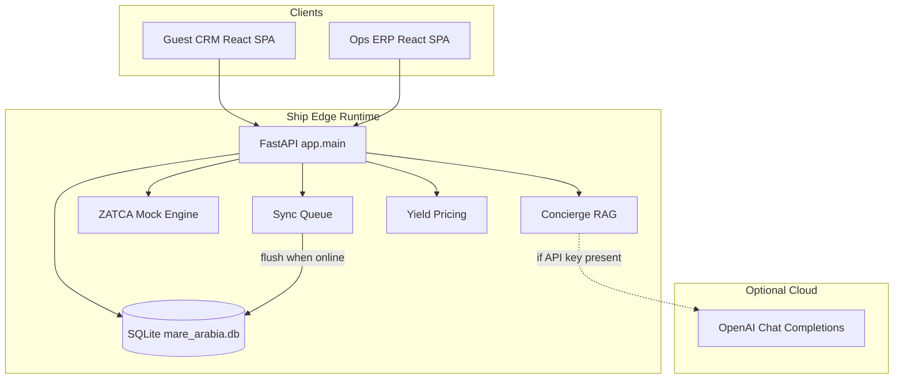
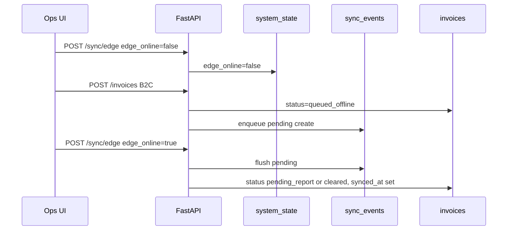
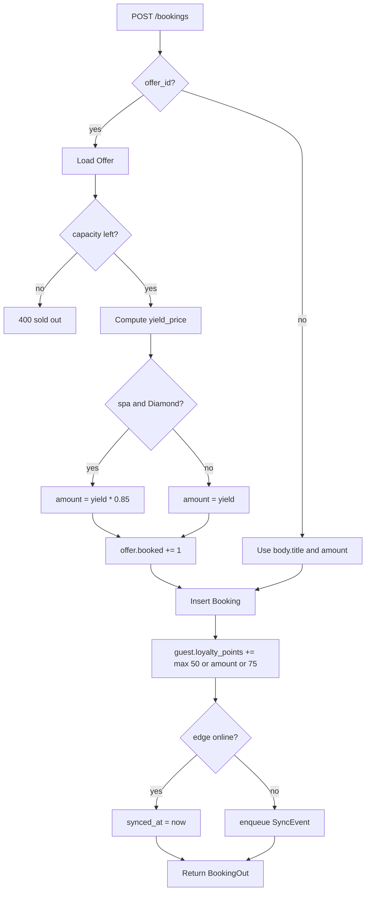
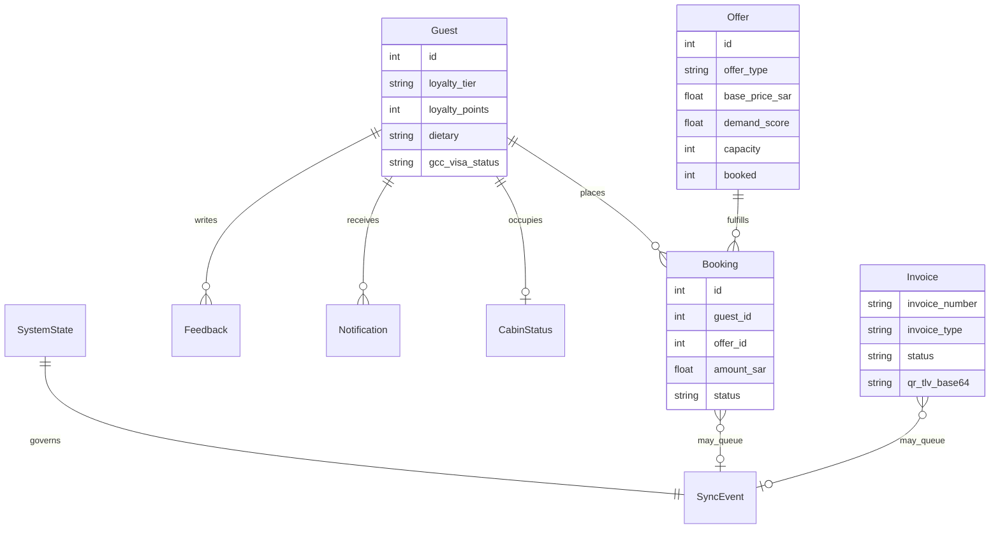

# Mare Arabia CRM/ERP: High-Level and Low-Level Technical Document

**Product:** Mare Arabia Cruises (demo brand) aboard *MS Horizon Pearl*  
**Domain:** AI-enabled CRM + ERP for Middle Eastern cruise operations (Arabian Sea to Red Sea)  
**Document type:** Implementation-accurate HLD + LLD for the current MVP  
**Version:** 0.2.0  
**Related:** [DESIGN.md](./DESIGN.md) (requirements and product vision), [README.md](../README.md) (runbook)

---

## Table of contents

1. [Purpose and scope](#1-purpose-and-scope)
2. [Problem statement](#2-problem-statement)
3. [High-level design (HLD)](#3-high-level-design-hld)
4. [Technology stack](#4-technology-stack)
5. [System context and actors](#5-system-context-and-actors)
6. [Feature catalog (what is implemented)](#6-feature-catalog-what-is-implemented)
7. [Low-level design (LLD)](#7-low-level-design-lld)
8. [Data model](#8-data-model)
9. [API reference](#9-api-reference)
10. [Frontend architecture](#10-frontend-architecture)
11. [Backend services (algorithms and flows)](#11-backend-services-algorithms-and-flows)
12. [Deployment and runtime](#12-deployment-and-runtime)
13. [Security, compliance, and demo boundaries](#13-security-compliance-and-demo-boundaries)
14. [What is intentionally out of scope](#14-what-is-intentionally-out-of-scope)
15. [File map](#15-file-map)

---

## 1. Purpose and scope

This document describes **exactly what the current codebase implements**: architecture, stack, modules, APIs, data stores, UI surfaces, and key algorithms. It is meant for:

- Pitch / stakeholder walkthroughs
- Engineering handoff
- Future Phase 2 planning against a clear MVP baseline

**In scope:** The monorepo at repository root (`backend/`, `frontend/`, `docs/`, Docker packaging).  
**Out of scope for production claims:** Live ZATCA Fatoora, live GCC visa APIs, multi-ship tenancy, Couchbase CRDT sync, real IoT hardware.

---

## 2. Problem statement

Cruise hospitality stacks are typically fragmented across reservation, PMS, POS, loyalty, inventory, and finance systems. Crew toggle between tools; guests get inconsistent answers; ships lose connectivity over satellite gaps.

This MVP demonstrates an **AI-enabled system of intelligence** for a fictional Middle Eastern cruise line:

| Need | How the MVP addresses it |
|------|--------------------------|
| Unified guest view | CRM guest profiles + bookings + loyalty + notifications |
| Personalized engagement | Hybrid AI concierge (RAG + optional OpenAI) |
| Regional compliance | Mock ZATCA Phase 2 B2C/B2B invoicing (TLV QR + XML) |
| Halal operations | Inventory flags + cold-chain sensor alerts |
| Faith-aware UX | Client-side Qibla bearing + approximate prayer times |
| At-sea resilience | Edge online/offline toggle + sync event queue |
| Commercial optimization | Demand/fill-based yield pricing on experiences |
| Hotel + engineering ops | Cabins, work orders, crew roster, sentiment inbox |

---

## 3. High-level design (HLD)

### 3.1 Architecture style

- **Monolith API** (FastAPI) with modular routers (CRM, ERP, hotel ops, AI/sync)
- **SPA frontend** (React + Vite) with two product surfaces: Guest CRM and Ops ERP
- **Embedded edge database** (SQLite) simulating shipboard local store
- **Optional cloud LLM** when `OPENAI_API_KEY` is set; otherwise deterministic RAG replies
- **Single-process hosting option**: FastAPI serves built static assets for one-URL demos



### 3.2 Logical domains

| Domain | Responsibility | Primary routers |
|--------|----------------|-----------------|
| CRM | Guests, itinerary, offers, bookings, loyalty earn | `crm.py`, parts of `hotel.py` |
| AI Engagement | Concierge chat over knowledge chunks | `ai_sync.py` + `services/concierge.py` |
| Finance / Tax | Mock ZATCA invoices | `erp.py` + `services/zatca.py` |
| Supply / IoT | Inventory, cold-chain sensors | `erp.py` |
| Hotel Ops | Cabins, feedback, notifications, loyalty redeem | `hotel.py` |
| Engineering / HR | Work orders, crew | `hotel.py` |
| Edge Sync | Online flag, pending events, flush | `ai_sync.py` + `services/sync.py` |
| Commercial | Yield prices on offers | `services/yield_pricing.py` |

### 3.3 Request lifecycle (happy path)

1. Browser loads SPA from FastAPI static files (or Vite dev server with proxy).
2. React calls `/api/v1/...` with JSON.
3. Router validates with Pydantic schemas.
4. SQLAlchemy session reads/writes SQLite.
5. Side effects (loyalty points, offer fill, sync enqueue, invoice QR) run in service layer.
6. Response returns typed JSON; UI updates.

### 3.4 Edge offline lifecycle



---

## 4. Technology stack

### 4.1 Frontend

| Layer | Choice | Role |
|-------|--------|------|
| UI library | React 19 (Vite template) | Component SPA |
| Build tool | Vite 8 | Dev server + production bundle |
| Routing | react-router-dom | Nested Guest/Ops routes |
| Styling | Custom CSS (`index.css`) | Maritime theme (Syne + Figtree fonts) |
| Client calc | `faith.js` | Qibla bearing, approx prayer times |
| HTTP | `fetch` via `api.js` | Thin REST client |

### 4.2 Backend

| Layer | Choice | Role |
|-------|--------|------|
| Language | Python 3.12 | Runtime |
| Framework | FastAPI 0.115 | REST API + OpenAPI docs |
| Server | Uvicorn | ASGI |
| ORM | SQLAlchemy 2.0 | Models + sessions |
| Validation | Pydantic v2 | Request/response schemas |
| Config | pydantic-settings | Env + defaults |
| DB | SQLite | Edge/demo persistence |
| Optional AI | openai Python SDK | Live concierge when keyed |

### 4.3 Packaging and ops

| Layer | Choice | Role |
|-------|--------|------|
| Container | Multi-stage Dockerfile | Node build frontend, then Python serve |
| Compose | docker-compose.yml | Port 8888, optional `OPENAI_API_KEY` |
| Default local port | **8888** | Avoids busy 8000/8080 |

### 4.4 What we are *not* using in this MVP

Couchbase Mobile, React Native, Redis, Postgres, Kafka, live Fatoora CSID, blockchain, real AIS risk feeds.

---

## 5. System context and actors

| Actor | Interface | Goals |
|-------|-----------|-------|
| Guest (demo profiles) | `/guest/:id/...` | Discover voyage, book experiences, chat, faith tools, loyalty, feedback |
| Crew / Ops / Finance | `/ops/...` | Monitor KPIs, invoices, cold chain, cabins, maintenance, sync |
| Pitch presenter | Landing + demo script | Show ME differentiators in ~4 minutes |
| Engineer | `/docs` OpenAPI + this document | Extend modules safely |

**Seeded demo brand:** Mare Arabia Cruises, vessel MS Horizon Pearl, corridor Muscat (Arabian Sea) → Jeddah (Red Sea) → Aqaba (Red Sea).

---

## 6. Feature catalog (what is implemented)

### 6.1 Guest CRM features

| Feature | UI route | Behavior |
|---------|----------|----------|
| 360 guest profile | `/guest/:id` | Cabin, loyalty tier/points, dietary, faith prefs, mobility, GCC visa status, nationality, check-in status |
| Voyage itinerary timeline | `/guest/:id` | Day/port/sea/arrival/departure/highlights/weather notes |
| Notifications | `/guest/:id` | Guest-specific + broadcast messages |
| AI Concierge | `/guest/:id/concierge` | Chat with RAG; quick prompts; mode badge (`rag-fallback` or `openai`) |
| Experiences catalog | `/guest/:id/experiences` | Filter dining/excursion/spa; show yield price, fill %, book |
| Faith / Qibla | `/guest/:id/faith` | Compass bearing to Makkah from ship lat/lon; approx prayer times |
| Loyalty | `/guest/:id/loyalty` | Points balance, tier progress, redeem 500/2000 point rewards |
| Bookings | `/guest/:id/bookings` | List, sync status, cancel (releases offer capacity) |
| Feedback | `/guest/:id/feedback` | Submit rating + comment; auto sentiment tag |

### 6.2 Ops ERP features

| Feature | UI route | Behavior |
|---------|----------|----------|
| Fleet KPI dashboard | `/ops` | Occupancy, guests, bookings, revenue, avg feedback, work orders, low stock, sensor alerts, edge status |
| Geopolitical risk banner | `/ops` | Static Red Sea corridor advisory + re-provision suggestion |
| Inventory board | `/ops` | SKUs, qty vs min, Halal certified flag |
| Recent bookings bridge | `/ops` | CRM bookings visible in ERP |
| Yield board | `/ops/yield` | Base vs yield price, demand %, fill meter |
| ZATCA invoicing | `/ops/invoices` | Create B2C simplified / B2B standard; TLV QR; UBL-like XML; ledger |
| Halal cold chain | `/ops/cold-chain` | Sensor readings; simulate tick; alert when out of band |
| Cabin housekeeping | `/ops/cabins` | Status board; advance housekeeping state |
| Maintenance | `/ops/maintenance` | List/create/close work orders |
| Crew roster | `/ops/crew` | Department, shift, on-duty flag |
| Sentiment inbox | `/ops/feedback` | Aggregated Positive/Neutral/Negative + table |
| Edge sync | `/ops/sync` | Offline toggle, offline POS sale, reconnect flush, event queue |

### 6.3 Cross-cutting platform features

| Feature | Implementation |
|---------|----------------|
| Seeded demo data | `seed.py` on startup if DB empty |
| CORS open for demo | `allow_origins=["*"]` |
| Health check | `GET /api/v1/health` |
| SPA fallback | FastAPI serves `backend/static` for non-API routes |
| Vite proxy (dev) | `/api` → `http://127.0.0.1:8888` |

---

## 7. Low-level design (LLD)

### 7.1 Repository layout

```
AI-enabled-CRM-ERP/
  backend/
    app/
      main.py              # FastAPI app, startup seed, static mount
      config.py            # Settings (DB URL, ship GPS, seller VAT, API keys)
      database.py          # Engine, SessionLocal, Base, get_db
      models.py            # SQLAlchemy tables
      schemas.py           # Pydantic I/O models
      seed.py              # Demo dataset
      routers/
        crm.py             # Guests, itinerary, offers, bookings
        erp.py             # Inventory, sensors, invoices, fleet
        hotel.py           # Cabins, WO, feedback, crew, notifications, loyalty redeem
        ai_sync.py         # Concierge chat + edge sync
      services/
        concierge.py       # RAG retrieve + LLM/fallback
        zatca.py           # TLV QR + XML builders
        sync.py            # Offline queue + flush
        yield_pricing.py   # Demand/fill price uplift
    requirements.txt
    static/                # Built SPA (copied from frontend/dist)
  frontend/
    src/
      App.jsx              # Route tree
      api.js               # REST client
      faith.js             # Qibla + prayer helpers
      components/Layout.jsx
      pages/Landing.jsx
      pages/guest/*        # CRM screens
      pages/ops/*          # ERP screens
      index.css            # Design system
  docs/
    DESIGN.md
    TECHNICAL_ARCHITECTURE.md   # this file
  Dockerfile
  docker-compose.yml
  README.md
```

### 7.2 Backend module responsibilities

| Module | Key types / functions | Notes |
|--------|----------------------|-------|
| `config.Settings` | `database_url`, `openai_api_key`, `ship_lat/lon`, `seller_vat` | Env-overridable |
| `database.get_db` | Generator dependency | Request-scoped session |
| `crm.create_booking` | Offer capacity++, loyalty earn, optional sync enqueue | Diamond spa 15% discount |
| `erp.create_invoice` | VAT 15%, status by online+type | Offline → `queued_offline` |
| `hotel._sentiment` | Heuristic from rating + keywords | Not an LLM |
| `concierge.retrieve_chunks` | Token overlap scoring | Boosts for halal/faith/excursion/loyalty |
| `yield_price` | `base * (1 + 0.2*demand + 0.15*fill)` | Returns 0 if base is 0 (included dining) |
| `zatca.build_tlv_qr` | Tags 1-5 real TLV; 6-9 mock crypto | Demo-safe, not Fatoora-valid |
| `sync.flush_pending` | Marks events synced; upgrades invoice statuses | Called on reconnect |

### 7.3 Frontend module responsibilities

| Module | Responsibility |
|--------|----------------|
| `Layout` | Brand nav, edge online badge (polls sync status) |
| `GuestLayout` | Guest selector + CRM subnav |
| `OpsLayout` | ERP subnav |
| `api.js` | All `/api/v1` calls centralized |
| `faith.js` | `qiblaBearing(lat,lon)`, `approxPrayerTimes(lat)` |

### 7.4 Booking flow (LLD)



### 7.5 Concierge flow (LLD)

1. Load guest by `guest_id`.
2. Tokenize message; score `knowledge_chunks` by token intersection + category boosts.
3. Take top 3 chunks (or first 3 if no score).
4. If `OPENAI_API_KEY` set: call `gpt-4o-mini` with system prompt + guest context + chunks; on failure fall back.
5. Else: rule templates for dining / excursion / faith / spa-weather / loyalty / default.
6. Return `{ reply, sources, suggestions, mode }`.

### 7.6 ZATCA mock flow (LLD)

1. `subtotal` → VAT 15% → `total`.
2. Status:
   - offline → `queued_offline`
   - online B2B → `cleared`
   - online B2C → `pending_report`
3. Build Base64 TLV QR (seller name, VAT, timestamp, totals + mock Phase-2 tags).
4. Build UBL-like XML string with profile `reporting:1.0` or `standard:1.0`.
5. Persist `Invoice` row; enqueue sync if offline.

---

## 8. Data model

### 8.1 Entity relationship (conceptual)



### 8.2 Tables (implemented)

| Table | Purpose | Notable fields |
|-------|---------|----------------|
| `system_state` | Singleton edge flag + risk banner | `edge_online`, `risk_banner` |
| `guests` | CRM profiles | `loyalty_points`, `check_in_status`, `gcc_visa_status` |
| `itinerary_stops` | Voyage legs | `day`, `port`, `sea`, `weather_note` |
| `knowledge_chunks` | Concierge RAG corpus | `category`, `tags`, `content` |
| `offers` | Bookable catalog | `demand_score`, `capacity`, `booked` |
| `bookings` | Reservations | `offer_id`, `synced_at`, `status` |
| `cabin_statuses` | Housekeeping board | `housekeeping`, `mini_bar` |
| `work_orders` | Maintenance | `priority`, `status`, `asset` |
| `feedback` | Guest voice | `rating`, `sentiment` |
| `crew_members` | Roster | `on_duty`, `department` |
| `notifications` | In-app messages | `kind`, `read`, nullable `guest_id` |
| `inventory_items` | F&B / spa stores | `halal_certified`, `min_quantity` |
| `sensor_readings` | Cold-chain IoT sim | `min_safe`, `max_safe`, `alert` |
| `invoices` | ZATCA mock ledger | `qr_tlv_base64`, `xml_payload` |
| `sync_events` | Offline queue | `status` pending/synced |

### 8.3 Seeded content (summary)

- 5 guests (Layla Diamond, James Pearl, Mei Gold, Omar Pearl, Sara Gold)
- 3 itinerary stops (Muscat, Jeddah, Aqaba)
- 6 offers (2 dining, 3 excursions, 1 spa)
- Knowledge chunks for dining, excursions, spa, faith, weather, loyalty
- Inventory + 3 sensors (one alert demo)
- Cabins, 3 work orders, feedback samples, crew, notifications

Database is created on startup (`Base.metadata.create_all`). Seed runs only when no guests exist. For schema changes in demo, delete `mare_arabia.db` and restart.

---

## 9. API reference

Base path: `/api/v1`  
Interactive docs: `http://localhost:8888/docs`

### 9.1 CRM

| Method | Path | Description |
|--------|------|-------------|
| GET | `/guests` | List guests |
| GET | `/guests/{id}` | Guest detail |
| GET | `/itinerary` | Voyage stops |
| GET | `/offers?offer_type=` | Catalog with computed yield fields |
| GET | `/bookings?guest_id=` | List bookings |
| POST | `/bookings` | Create booking (optional `offer_id`) |
| POST | `/bookings/{id}/cancel` | Cancel + free capacity |

### 9.2 AI and sync

| Method | Path | Description |
|--------|------|-------------|
| POST | `/concierge/chat` | `{ guest_id, message }` → reply |
| GET | `/sync/status` | Edge online, pending count, ship GPS |
| GET | `/sync/events` | Recent sync queue |
| POST | `/sync/edge` | `{ edge_online }` (flush if true) |
| POST | `/sync/flush` | Flush if currently online |

### 9.3 ERP

| Method | Path | Description |
|--------|------|-------------|
| GET | `/inventory` | Items + `low_stock` |
| GET | `/sensors` | Cold-chain readings |
| POST | `/sensors/simulate-tick` | Nudge demo temperatures |
| GET | `/invoices` | Ledger |
| POST | `/invoices` | Create B2C/B2B mock invoice |
| GET | `/fleet/snapshot` | Aggregated ops KPIs |

### 9.4 Hotel / HR / loyalty

| Method | Path | Description |
|--------|------|-------------|
| GET | `/cabins` | Housekeeping board |
| PATCH | `/cabins/{id}` | Update housekeeping/minibar/notes |
| GET/POST | `/work-orders` | List / create |
| PATCH | `/work-orders/{id}` | Update status/assignee/priority |
| GET/POST | `/feedback` | List / create with sentiment |
| GET | `/crew` | Roster |
| GET | `/notifications?guest_id=` | Guest + broadcast |
| POST | `/notifications/{id}/read` | Mark read |
| POST | `/loyalty/redeem` | Spend points + notify |

### 9.5 Offer response shape (computed)

`OfferOut` adds fields not stored raw:

- `yield_price_sar` from `yield_price(...)`
- `remaining = capacity - booked`
- `fill_pct`

---

## 10. Frontend architecture

### 10.1 Route tree

| Path | Page component |
|------|----------------|
| `/` | Landing |
| `/guest/:guestId` | GuestHome |
| `/guest/:guestId/concierge` | Concierge |
| `/guest/:guestId/experiences` | Experiences |
| `/guest/:guestId/faith` | Faith |
| `/guest/:guestId/loyalty` | Loyalty |
| `/guest/:guestId/bookings` | Bookings |
| `/guest/:guestId/feedback` | GuestFeedback |
| `/ops` | OpsOverview |
| `/ops/yield` | YieldBoard |
| `/ops/invoices` | Invoices |
| `/ops/cold-chain` | ColdChain |
| `/ops/cabins` | Cabins |
| `/ops/maintenance` | Maintenance |
| `/ops/crew` | Crew |
| `/ops/feedback` | OpsFeedback |
| `/ops/sync` | SyncPanel |

### 10.2 Design system notes

- CSS variables: deep teal/navy maritime palette, sand accent
- Fonts: Syne (display), Figtree (body)
- Patterns: panels, KPI grid, timeline, chips, meters, toast confirmations
- UI copy avoids em dashes per product preference

### 10.3 Dev vs prod serving

- **Dev:** Vite on 5173, proxies `/api` to backend 8888
- **Prod/Docker:** `npm run build` → copy `dist` to `backend/static` → Uvicorn serves API + SPA

---

## 11. Backend services (algorithms and flows)

### 11.1 Yield pricing

```text
if base <= 0: return 0
fill = booked / capacity
uplift = 1 + 0.2 * demand_score + 0.15 * fill
price = round(base * uplift, 2)
```

Booking an offer also bumps `demand_score` by +0.02 (capped at 0.98).

### 11.2 Loyalty earn / redeem

- **Earn on booking:** `max(50, int(amount))` if amount else `75`
- **Redeem:** subtract points if sufficient; create loyalty notification
- **Tier labels (UX only):** Pearl / Gold / Diamond thresholds shown in UI (5000 / 10000)

### 11.3 Faith mathematics (client)

- Qibla: great-circle bearing from ship `(lat, lon)` to Makkah `(21.4225, 39.8262)`
- Prayer times: approximate solar geometry from latitude/day-of-year (demo accuracy only)

### 11.4 Sensor simulation

`POST /sensors/simulate-tick` increases Cold Store B temperature and recomputes `alert` vs `[min_safe, max_safe]`.

---

## 12. Deployment and runtime

### 12.1 Local (two processes)

```bash
# Terminal 1
cd backend && source .venv/bin/activate
uvicorn app.main:app --reload --port 8888

# Terminal 2
cd frontend && npm run dev
```

### 12.2 Local single URL

Build frontend, copy to `backend/static`, run Uvicorn on 8888, open `http://127.0.0.1:8888`.

### 12.3 Docker

```bash
docker compose up --build
```

Exposes **8888**. Optional env: `OPENAI_API_KEY`. Volume persists `/app/data` SQLite when using compose `DATABASE_URL`.

### 12.4 Environment variables

| Variable | Default | Meaning |
|----------|---------|---------|
| `DATABASE_URL` | `sqlite:///./mare_arabia.db` | SQLAlchemy URL |
| `OPENAI_API_KEY` | empty | Enables live concierge |
| `GOOGLE_API_KEY` | empty | Reserved in settings (not wired in MVP) |
| Seller/ship settings | in `config.py` | Demo VAT, GPS, ship name |

---

## 13. Security, compliance, and demo boundaries

| Topic | MVP reality |
|-------|-------------|
| AuthN/AuthZ | None (open demo API) |
| ZATCA | Simulated only; not legally compliant; no CSID |
| PCI / payments | Not implemented |
| PII | Fake seeded emails only |
| CORS | Permissive for local pitch |
| Secrets | API keys via env only; never commit `.env` |

Pitch language should say **"ZATCA Phase 2 simulation"** and **"offline edge sync prototype"**.

---

## 14. What is intentionally out of scope

Documented for roadmap clarity:

- Couchbase Mobile / CRDT bidirectional sync
- Live Fatoora clearance/reporting APIs
- Live GCC Unified Visa integration
- React Native guest app
- Multi-ship multi-tenant RBAC
- Real IoT / predictive maintenance ML models
- Blockchain Halal provenance ledger
- Resort PMS federation
- Production Saudi data residency cloud deployment

---

## 15. File map

### Backend entry and core

| File | Role |
|------|------|
| `backend/app/main.py` | App factory, routers, startup seed, static SPA |
| `backend/app/models.py` | All ORM entities |
| `backend/app/schemas.py` | API contracts |
| `backend/app/seed.py` | Demo world |

### Backend routers / services

| File | Role |
|------|------|
| `routers/crm.py` | Guest commercial CRM |
| `routers/erp.py` | Ops finance + inventory + fleet |
| `routers/hotel.py` | Hotel/HR/loyalty/feedback |
| `routers/ai_sync.py` | Concierge + edge |
| `services/concierge.py` | RAG + LLM |
| `services/zatca.py` | Tax document mock |
| `services/sync.py` | Offline queue |
| `services/yield_pricing.py` | Dynamic price |

### Frontend

| File | Role |
|------|------|
| `frontend/src/App.jsx` | Routes |
| `frontend/src/api.js` | HTTP facade |
| `frontend/src/pages/guest/*` | CRM UX |
| `frontend/src/pages/ops/*` | ERP UX |

---

## Appendix A: Traditional vs this MVP (pitch one-pager)

| Layer | Traditional CRM/ERP | This AI-enabled MVP |
|-------|---------------------|---------------------|
| Guest | Static profiles | 360 profile + AI concierge + notifications |
| Commerce | Fixed catalogs | Yield-aware experiences + loyalty |
| Finance | Manual tax docs | Mock ZATCA B2C/B2B with QR/XML |
| Supply | Periodic checks | Live low-stock + cold-chain alerts |
| At sea | Degrades offline | Explicit offline queue and sync UX |
| Ops | Siloed tools | One ERP desk: yield, cabins, WO, crew, sentiment |

---

## Appendix B: Suggested demo path (aligned with README)

1. Landing brand story  
2. Guest profile + itinerary  
3. Book experience (watch yield price and points)  
4. Concierge Halal dinner question  
5. Faith Qibla  
6. Ops KPIs + risk banner  
7. Yield board  
8. Issue ZATCA B2C invoice  
9. Cabins / maintenance glance  
10. Offline POS + reconnect sync  
11. Cold-chain sensor tick alert  

---

*End of technical document. For product requirements matrix (MVP vs later), see [DESIGN.md](./DESIGN.md).*
